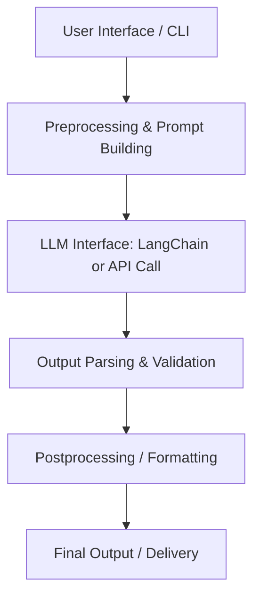

```mermaid
flowchart TD
    UI[User Interface / CLI] --> PRE[Preprocessing & Prompt Building]
    PRE --> LLM_API[LLM Interface: LangChain or API Call]
    LLM_API --> PARSE[Output Parsing & Validation]
    PARSE --> POST[Postprocessing / Formatting]
    POST --> OUT[Final Output / Delivery]
```